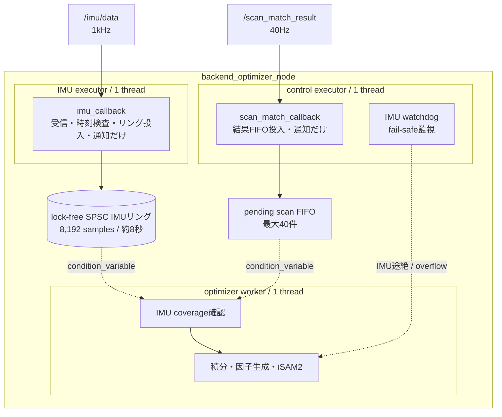

# Backend Optimizer 推定手順(2026-07-30更新)

`lio_localization::BackendOptimizerNode` の因子グラフ構造とデータフローの図。
2026-07-28の減速時誤差スパイク調査で確認した構造を元に作成し、2026-07-29の
専用最適化ワーカー、IMU専用executor、lock-free SPSC IMUリングバッファを反映。
2026-07-30に②(`laser_scan_matching_node`)側にも同型の専用ICP workerを追加した
(実行ドメイン節末尾の追記、experiment_history 14番参照)。要件Aの達成状況・
残る誤差要因の最終的な切り分け結果は
[localization_final_report_2026-07-30.md](localization_final_report_2026-07-30.md)
にまとめてある。

## 実行ドメイン



IMU callback groupはnodeへ自動登録せず、IMU executorへ手動で割り当てる。そのため
scan callbackやwatchdogがreadyでも、IMU callbackの実行枠を奪えない。iSAM2はROS
executorではなくoptimizer workerだけが所有する。したがって、3スレッドは同じ仕事を
競合して実行するためではなく、**IMU受信・control callback・最適化を互いにブロックしない
ための固定した責務分離**である。

## 全体フロー

```mermaid
flowchart TD
    IMU["IMU /imu/data<br/>1kHz"] --> QUEUE["imu_queue_<br/>(imu_callback)"]
    SCAN["LiDARスキャン<br/>40Hz"] --> PERCEPTION["② 知覚(laser_scan_matching_node)<br/>planar 2D point-to-segment solverが<br/>実際にwall姿勢を公開(詳細は次節)"]
    PERCEPTION --> SMR["ScanMatchResult<br/>(wall + cylinders)"]

    SMR --> PEND["pending_results_<br/>(scan_match_callback)"]
    PEND --> EVENT["condition_variableへ通知<br/>(callbackはここで終了)"]
    QUEUE -.->|"IMU到着時にも通知"| EVENT
    EVENT --> DRAIN{"専用optimizer worker<br/>スキャン時刻分のIMUは<br/>全部届いた?"}
    DRAIN -->|"未着"| WAIT["condition_variableで待機<br/>(次の通知で再判定)"]
    DRAIN -->|"到着済み"| PROCESS["process_scan_result<br/>(GTSAMは専用workerだけが実行)"]

    PROCESS --> INTEGRATE["integrate_imu_up_to<br/>実測dtで積分<br/>+端数はゼロ次ホールドで詰める"]
    INTEGRATE --> ACCUMULATOR[("accumulator_<br/>backend_optimizer_nodeの<br/>メンバ変数(常駐バッファ)")]
    ACCUMULATOR --> IMUFACTOR["CombinedImuFactor<br/>(無条件で必ず追加)<br/>※wallの値は一切参照しない"]

    PROCESS -->|"wall.valid"| WALLGATE{"物理妥当性ゲート<br/>d_xy と physical_gate_xy / wall_gate_xy_ の比較"}
    WALLGATE -->|"d_xy <= physical_gate_xy<br/>(通常範囲)"| WALLFACTOR["壁PriorFactor<br/>(通常σ)"]
    WALLGATE -->|"physical_gate_xy超過〜wall_gate_xy_(1.0m)以下<br/>(DCS)"| DCSFACTOR["壁PriorFactor<br/>(σをDCSで拡大=弱く採用)"]
    WALLGATE -->|"wall_gate_xy_超過 or wall_gate_yaw_(1.2rad)超過<br/>(拒否)"| REJECT["consecutive_wall_rejections_++<br/>(このスキャンは壁因子を追加しない)"]

    IMUFACTOR --> ISAM2["IncrementalFixedLagSmoother<br/>(ISAM2, lag=0.5s)<br/>全因子をまとめて最適化"]
    WALLFACTOR --> ISAM2
    DCSFACTOR --> ISAM2

    ISAM2 --> ESTIMATE["/state_estimate publish<br/>(40Hz、backend自身の出力)"]
    ESTIMATE -.->|"①がこれを基準にIMUで外挿"| ODOMFAST["①imu_preintegration_node<br/>/odom_fast (~1kHz)<br/>評価・ロボット制御が使うのはこちら"]
    ISAM2 -.->|"次スキャンに向けて空にする"| RESETACC["accumulator_リセット<br/>(resetIntegrationAndSetBias)"]
    RESETACC -.-> ACCUMULATOR
    ISAM2 -.->|"数値例外"| DIVERGE["reset_graph_after_divergence"]
    REJECT -.->|"40回連続(~1秒)<br/>※現行Unity設定では円柱0件のため機能しない"| RELOC["円柱で真偽判定→再ローカライズ<br/>(dead code path、後述)"]
    style SCAN fill:#2a2410,stroke:#996
    style PERCEPTION fill:#2a2410,stroke:#996
    style SMR fill:#2a2410,stroke:#996

    style INTEGRATE fill:#1a2a1a,stroke:#393
    style ACCUMULATOR fill:#1a2a1a,stroke:#393
    style IMUFACTOR fill:#1a2a1a,stroke:#393
    style RESETACC fill:#1a2a1a,stroke:#393

    style WALLGATE fill:#1a2a3a,stroke:#369
    style WALLFACTOR fill:#1a2a3a,stroke:#369
    style DCSFACTOR fill:#1a2a3a,stroke:#369
    style REJECT fill:#1a2a3a,stroke:#369

    style ISAM2 fill:#2a1a3a,stroke:#639
    style ESTIMATE fill:#2a1a3a,stroke:#639
    style ODOMFAST fill:#2a1a3a,stroke:#639

    style DIVERGE fill:#3a1a1a,stroke:#a33
    style RELOC fill:#555,stroke:#888,stroke-dasharray: 5 5
```



### 図の各ブロックの補足説明

**両方のコールバックは受信・キュー追加・ワーカー通知だけを行う**

`imu_callback`(IMU到着時)・`scan_match_callback`(スキャン結果到着時)は、それぞれ
自分のFIFO(`imu_queue_`, `pending_results_`)へ追加し、condition variableで専用
optimizer workerを起こして終了する。workerは先頭スキャンの時刻までIMUが届いたことを
確認してから`process_scan_result`・IMU積分・ISAM2更新を直列実行する。GTSAMの状態を
触るのはこのworkerだけである。IMU callback groupは専用`SingleThreadedExecutor`、
scan callbackとwatchdogは別の`SingleThreadedExecutor`で動くため、ISAM2更新中だけでなく
control executor内のcallback実行中にもIMU executorは1kHz受信を継続できる。

`imu_queue_`は動的に伸びる`deque`ではなく8,192件の固定長**lock-free SPSCリング**である。
専用IMU executorだけがproducer、optimizer workerだけがconsumerなので、1kHzの投入・取り出し・
積分に`work_mutex_`は使わない。通常は2秒ホライズンで古い値を削除する。この削除もproducerでは
なくwatchdogから通知されたworkerが、保留スキャンも実行中ジョブも無いときだけ行う。従ってworkerが
必要とする積分区間を並行して消すことはない。8秒相当まで滞留した場合は、IMUを黙って捨てて不連続な
因子を作る代わりにoverflowをfail-safeとしてラッチする。`pending_results_`は40Hz・最大40件の
低頻度FIFOで、こちらと`worker_stop_`・`optimizer_busy_`だけを`work_mutex_`で保護する。
重いISAM2更新中にはmutexを保持しない。IMUサブスクリプションの深いQoS(`SensorDataQoS().keep_last(2000)`)も輸送・
スケジューリングの短時間ジッタに対する余裕として維持する。

ノード破棄時は停止フラグを設定してworkerを起こし、`join()`完了後にメンバを破棄する。
また、IMU watchdogが並行してfail-safeをラッチした場合は保留スキャンを破棄し、
取り出し済みジョブからの`/state_estimate`公開も抑止する。

**②(`laser_scan_matching_node`)にも同型の専用ICP workerがある(2026-07-30追加)**

backendと同じ「executorはキュー投入だけ、重い処理は専用workerだけが触る」パターンを
②にも適用した(experiment_history 14番)。以前は`odom_callback`(/odom_fastの
姿勢履歴追記)・`imu_callback`(生ジャイロ履歴追記)・`scan_callback`(ICP本体)が
すべて同一の単一executorスレッド上で直接実行されており、ICP1回(数ms〜数十ms)の間
①からの受信そのものが止まって姿勢履歴が古びる問題があった(Unity直結時のみbag再生
より最大誤差が悪化する原因、experiment_history 13番)。現在は`odom_callback`/
`imu_callback`を専用`pose_callback_group_`(backendのIMU executorと同じ設計)に
分離し、ICP本体(`process_scan`)は`icp_worker_`専用スレッドが、`odom_history_`/
`gyro_history_`のスナップショットを取ってから実行する。`scan_callback`は
`pending_scans_`へのFIFO投入と通知だけを行う。

**IMU積分(`integrate_imu_up_to`)は「時間を揃えるための作業」**

`imu_queue_`に貯まっている1kHzのIMUサンプルを、古い順に1個ずつ取り出して`accumulator_`(GTSAMの積分器)に足し込んでいく。ポイントは2つ:

1. 各サンプルは「前のサンプルとの実際の時刻差(dt)」で積分する(1msと決め打ちしない)。ホスト負荷でdtが伸び縮みしても正しく積分できるようにするため
2. 最後、積分した最新サンプルの時刻と「今回のスキャンの時刻」の間にわずかな端数(1ms未満〜数十ms)が残ることがあるので、直近のIMU値を保持したままその端数分も埋める(ゼロ次ホールド)。これにより積分の終わり目を必ずスキャン時刻ぴったりに揃える

**IMU因子は独立。壁補正が拒否されても「IMU因子だけ」ではない**

`CombinedImuFactor`は`accumulator_`(=IMU積分結果)だけから作られ、`wall`の値を一切見ない。物理妥当性ゲートで壁補正が拒否された回は、**新しい壁PriorFactorがグラフに追加されないだけ**。その回の状態(推定値)は、今回のIMU因子に加えて、fixed-lag窓(0.5秒)内にまだ残っている過去の壁因子・過去の状態・(登録されていれば)円柱因子との**同時最適化**で決まる。直前までの壁補正による拘束の影響は窓内で生き続ける。

**壁補正のゲートは拒否/採用の二択ではなく三段階(DCS)**

物理妥当性ゲート(`d_xy`, `d_yaw`)は次の3段階:

1. `d_xy <= physical_gate_xy`(数mm〜1cm程度): 通常のσで採用
2. `physical_gate_xy < d_xy <= wall_gate_xy_`(1.0m以下): **DCS(Dynamic Covariance Scaling)**でσを`d_xy / physical_gate_xy`倍に拡大し、弱く採用(信頼度を下げるが排除はしない)
3. `d_xy > wall_gate_xy_` または `d_yaw > wall_gate_yaw_`(1.2rad): 拒否、`consecutive_wall_rejections_`をインクリメント

物理妥当性ゲートは基本的に「拒否ゲート」ではなく「重み低下(DCS)処理」で、実際に拒否まで至るのは大きく外れた場合だけ。

最後に、ISAM2の更新が終わると`accumulator_`は次のスキャン区間に向けてリセットされ(積分結果はこの1回だけで使い切り)、また次のスキャンが来るまで新しいIMUを貯め始める。`accumulator_`自体は`BackendOptimizerNode`クラスのメンバ変数(`backend_optimizer_node.hpp`)で、別ノードや外部コンポーネントではなく、backendプロセス内に1つだけ常駐しているバッファ。

**`/state_estimate`(40Hz)と`/odom_fast`(~1kHz)は別物**

backend自身が出す推定値は`/state_estimate`で、スキャン処理と同じ40Hz。時間分解能が粗く見えるかもしれないが、これは①(imu_preintegration_node)が`/state_estimate`を基準としてIMU積分だけで~1kHzへ外挿し続けた`/odom_fast`を別途配信しており、評価やロボットの制御ループが実際に使っているのはこちら。つまり「40Hzの絶対補正 + 1kHzのIMU外挿」の組み合わせで、実効的な時間分解能はIMU側(1kHz)まで確保されている。

**IMU fail-safeはロボットを止めない**

`imu_watchdog`が途絶を検知して行うのは、backendの以降のグラフ更新停止(`imu_fault_latched_=true`)だけ。モータ停止指令や安全制御へのエラー通知は出さない。「自己位置推定の出力を止める」ことは保証するが、「ロボットを安全に停止させる」ことはこのシステム単体では保証されず、`/odom_fast`(または`/state_estimate`)の途絶を検知して停止する契約を制御側に別途持たせる必要がある。

## 状態変数

| 記号 | 型 | 内容 | 生存期間 |
|---|---|---|---|
| `X(k)` | Pose3 | 位置+姿勢 | スキャン毎、lag超過で周辺化 |
| `V(k)` | Vector3 | 速度 | 同上 |
| `B(k)` | ConstantBias | 加速度計+ジャイロバイアス(6次元) | 同上 |
| `C(id)` | Point3 | 円柱ランドマーク位置 | 検出され観測が続く限り保持。グラフリセット時(`reset_graph_after_divergence`)は`cylinders_in_graph_`がクリアされ消える |

円柱は`X(k)`に対する絶対拘束ではなく、事前分布σ=既定0.5m(かなり緩い)を持つ独立した状態変数として最適化対象に含まれる。「既知の地図情報」として扱うなら、位置を固定値にするか、実測地図精度相当(数mm〜数cm)まで事前分布を締める方が論理的に一貫する(現状Unity設定では円柱自体が未登録のため精度への影響はない)。

## 知覚(② laser_scan_matching_node)の詳細

実際にwall姿勢として`ScanMatchResult`に公開されるのは**planar 2D point-to-segment
solver**であり、汎用3D ICP(coarse-to-fine、対応距離を広→狭へ段階的に絞る方式)は
**未マップ点・円柱抽出のためだけに実行され、その壁姿勢はUnityフィールドでは一切
公開されない**。コード上も明記されている:

```cpp
// The generic 3-D ICP remains available for its unmatched-point/circle extraction
// below, but it must never publish a pose correction in this Unity field path.
```
(`laser_scan_matching_node.cpp:851`付近)

planar solverの処理順序(`laser_scan_matching_node.cpp:772`付近):

1. **planar ICP 第1パス**: 全点を使って2D位置(x, y, yaw)を解く(Gauss-Newton的な反復)。この時点ではnotesの影響でまだ数mm〜cm程度バイアスされ得るが、次のnotes判定には十分
2. **未マップ点の抽出**: 第1パスの姿勢から、既知の壁セグメントに近い点を除いた「地図で説明できない点」を集める
3. **notes候補のクラスタ除外**: 隣接する未マップ点をクラスタ化し、クラスタの大きさ(`ball_exclusion_max_extent_`)と点数(`ball_cluster_min_points_`)がnotes(Blue/Orangeどちらも対象)らしい範囲に収まるものだけを除外対象にする
4. **planar ICP 第2パス**: 除外後の点群で再度solve(除外点が無ければ第1パスの結果をそのまま使う)

有効性判定(`planar_valid`)は次の**4条件**(対応点の割合は使わない):

- 対応点数が`planar_min_inliers_`以上
- 平均残差が`planar_max_mean_residual_`以下
- 初期シードからの**位置補正量**(`planar_shift`)が`planar_max_shift_`(現行yaml: 0.12m)以下
- 初期シードからの**ヨー補正量**(`planar_yaw_shift`)が`planar_max_yaw_shift_`(現行yaml: 0.08rad)以下

**全体の対応点数Nは実測値。軸別の内訳と共分散値は人工値**

```cpp
result.wall.correspondence_count = planar_inliers;                         // 実測値(スキャンごとに変動)
result.wall.covariance = {1e-5, 0.0, 0.0, 0.0, 1e-5, 0.0, 0.0, 0.0, 1e-5};  // 固定値
result.wall.x_axis_correspondence_count = planar_inliers / 2;               // Nの単純折半
result.wall.y_axis_correspondence_count = planar_inliers - planar_inliers / 2;
result.wall.x_axis_degenerate = false;  // 常にfalse
result.wall.y_axis_degenerate = false;  // 常にfalse
```
(`laser_scan_matching_node.cpp:840-861`付近)

`correspondence_count`(全体N)は**planar ICPの実際の対応点数**で、スキャンごとに
本当に変動する(実測: 484〜541、`diag_wall_corr.csv`参照)。backendの
`yaw_sigma = wall_prior_base_yaw_sigma_ / √N`はこの実測Nに基づいて正しく動的計算
されている。

人工値なのは次の3つに限られる:

- `x_axis_correspondence_count`/`y_axis_correspondence_count`: 全体Nは本物だが、X向き・Y向きへの配分は常に機械的な折半で、実際にどちらの向きの壁に何点対応しているかは反映していない。そのため軸別の`x_sigma`/`y_sigma`は実際の軸別視認性を反映しない
- `covariance`: 固定値`1e-5`。ICP自体が計算した実測の共分散ではない
- `x_axis_degenerate`/`y_axis_degenerate`: 常にfalseで、縮退軸の緩和ロジックが発火しない

そのため、ICP共分散によるσのクランプ(`wall_use_icp_covariance: true`)は、実測ではなく固定`1e-5`という無意味な値に基づいて動作している。全体Nに基づくyaw方向のσ計算は健全だが、軸別の重み付けと縮退検出は現状機能していない。この非対称性(全体は実測、軸別は人工)は、減速時スパイクの挙動と関係している可能性があるため、優先して再検討すべき箇所である。

**円柱(ビンゴポスト)マッチングと復旧経路は現行Unity設定では機能しない**

現行の`robocon2026_unity.yaml`には`cylinder_ids`/`cylinder_x`/`cylinder_y`が一切
設定されておらず、`registered_cylinders_`が空になる。そのため:

- 円柱`BearingRangeFactor`は発生しない(観測数は常に0)
- 壁補正拒否が連続した際の「円柱で真偽判定→再ローカライズ」という復旧経路(main.md記載の設計)は、円柱観測が無いため判定不能で機能しない — 拒否が続く限り拒否し続けるだけになる
- さらに`dropout_error_sec=120秒`に対して評価窓は60秒のため、**LiDAR信頼性喪失によるERRORレベルの通知(main.md記載)もベンチマーク中には発火しない**

現行のUnity試験構成には、持続的な壁/IMU不一致からの自動復旧経路が事実上存在しない。

### ScanMatchResult(知覚→backendのメッセージ)

```
std_msgs/Header header
WallCorrection wall              # 実際に公開されるのはplanar 2D solverの結果(全体N=実測、軸別内訳・共分散値は人工値)
CylinderObservation[] cylinders  # 検出された円柱の観測(現行Unity設定では常に空配列)
```

## 生IMU値の直接調査(2026-07-28)

`raw_imu_inspect_20260728`はガウス性の白色雑音のみを停止した実験で、固定バイアス
(x=+0.05, y=-0.03)・ジャイロバイアス(z=+0.005)・ランダムウォーク(σ=0.0001)は
通常運用の値のまま動作していた。`diag_raw_imu.csv`のt≧3s平均(ax=+0.0575,
ay=-0.0418, gz=+0.00426)は設定バイアス値とほぼ一致する。

`/imu/data`の生値を1kHzで記録して誤差ピーク(t≈58.95s)前後を確認した。

- az(重力方向)は9.79〜9.82 m/s²で終始一定。gz(角速度)は0.003〜0.007 rad/sで、
  設定したジャイロバイアス(+0.005 rad/s)付近で安定しており、異常な回転はない。
  信号飽和・NaN・通信破損は確認されない
- ax/ayは減速→符号反転→逆方向加速という物理的に正常な方向転換パターン
- t=58.85〜59.10s窓内の局所最大はax≈+6.20 m/s²で、設計上限(0.5G=4.905 m/s²)比では
  この1窓に限れば約26%超過。**全走行を通せば平面加速度(ax・ayの合成)の最大は
  約10.38 m/s²に達し、これは設計上限の約2.1倍(約112%超過)**であり、折り返しの
  たびに大きく超過している。t=58.95s付近1箇所だけでなく、全折り返しでの超過状況を
  対象に含めて調査する必要がある
  - PD制御力自体は`Vector3.ClampMagnitude(force, maxForce)`で確実にクランプされている
  - しかし実測加速度(速度の有限差分)は、地面摩擦・物理ソルバーの拘束解決など**制御力以外の副次的な力を含む正味の値**であり、クランプの対象外
  - backend側の`kMaxAcceleration=4.905`という壁補正ゲート計算での仮定とも齟齬があるが、この項は`dt²`(スキャン間隔≈25ms)でスケールするため通常運用ではLiDARノイズマージン(45mm)に埋もれてほぼ効かず、DCS発火・壁補正拒否のログはこのrun全体で1件も出ていない

NaN・信号飽和・通信破損といった**センサー故障の兆候はない**。ただし**設計上の運動
モデル(0.5G上限)を大きく外れた運動が実際に起きている**のは事実であり、この2つは
別の主張として扱う必要がある。「センサー値自体には異常がない」ことと「設計上限を
2倍以上超える運動をしている」ことは両立し、後者を軽視してよい根拠にはならない。

## 現在オフになっている実験的機構(2026-07-28の減速時スパイク調査で導入・棄却)

- `zupt_enabled_` (既定false): 低速時にV(k)へ速度=0の疑似観測を追加。閾値0.1は効果薄、0.5は27.92mmスパイクを誘発し棄却。
- `imu_dynamics_enabled_`(コード上の宣言既定値は`true`だが、現行`robocon2026_unity.yaml`が明示的に`imu_dynamics_enabled: false`を上書きしているため実行時は無効。コードのデフォルト値とyamlの実効値は別物として扱うこと): IMU予測速度変化(推定加速度)がしきい値超過時に壁σを締める。閾値2.0m/s²は巡航中の通常加減速(4-7m/s²)でも常時発火し局所対策になっていなかった(この閾値・実装が有効でなかっただけで、動的補正という方式自体を否定する試験ではない)。

## この調査で切り分け済みの事項(2026-07-28)

減速直前~直後の位置誤差スパイク(12〜16mm、要件A max≤10mmをFAIL)について、以下は**今回試した設定・条件下ではいずれも改善せず、主要因である可能性が下がった**(完全に原因を棄却する試験ではない):

- バイアス(固定値・ランダムウォークいずれも、ゼロにしても同じ規模で発生)
- センサノイズ(1/10に下げてもmaxは改善せず、ヨーのみ改善)
- `smoother_lag_sec`(0.5→1.5に戻しても悪化するのみ)
- `relinearizeThreshold`(0.01→0.001でも変化なし)
- 生IMU値自体(ノイズ停止して直接確認、物理的に正常な減速→方向転換の挙動)

残る候補(2026-07-28時点の記録。以下は2026-07-30時点でのその後の切り分け結果):

- **planar solverの軸別対応点数の均等割り当て・固定共分散値**: 未修正のまま残っている(下記参照)。
- 壁補正(ICP)側の幾何学的性質: **特定済み**。ノーツ(ボール)除外ロジックの不完全性が原因(下記参照)。
- Unity物理エンジンが設計加速度上限(0.5G)を超過している事実そのもの: 事実として残るが、以下の2026-07-30調査で主要因ではないと判明。
- IMU/LiDARの時刻同期・deskewの残差、closed-loop制御自体の影響、backendの因子重み付け設計: **大部分を検証済み**(下記参照)。

## 2026-07-30の追加調査(experiment_history 13〜15番)で判明した事項

14番のICP worker分離(前節参照)により、Unity直結時の最大位置誤差はbaseline
17.55mmから4〜5mm台まで改善した。この残留する数mm級スパイクをさらに切り分けた
結果:

1. **配送・スケジューリング遅延は原因ではない**: 同じ物理走行のUnity生成センサ値を
   CSV記録→MCAP化してROS単体で再生したところ(転送ジッタ・IMUカバレッジ待ち
   タイムアウト・スムーサー遅延を実質ゼロにできる)、それでも同じ時刻・同じ大きさの
   スパイクがそのまま再現された。IMUの精度・遅延はいずれも無関係と確認済み。
2. **ノーツ除外の不完全性が主要因**: bag再生ログでノーツ由来の未説明点群とスパイク
   時刻が一致することを確認し、`RoboconFieldBuilder`のノーツ無効化フラグで
   A/Bテストした結果、最大位置誤差が4〜5mm台から1.75mmまで低下しスパイクが
   消滅した。これにより上記「軸別対応点数の均等割り当て・固定共分散値」よりも、
   ノーツ除外(`ball_exclusion_*`パラメータ)側が支配的要因であると判明した。
3. **残る1.7mm級の残差は旋回ダイナミクス起因**: ノーツ無効化後もなお残る1.7mm級の
   ピークは、Unity記録の実角速度データで実際の急旋回(0→約1.5rad/s)と時刻が一致
   することを確認した。線形加速度トリガー版で無効化済みだった`imu_dynamics_*`の
   角速度トリガー版(`imu_dynamics_gyro_*`)を実装しA/Bテストしたが、有意な改善は
   得られなかった(1.7346mm→1.7333mm、ノイズレベルの差)。壁補正のσを締めても
   「補正が届くまでの待ち時間」自体は縮まらないため、スキャン周期(40Hz=25ms)に
   内在する遅れの可能性が高いが、これは推論であり直接検証はしていない。

要件A(定常RMSE≤10mm・最大位置誤差≤10mm)はノーツありの状態でも十分な余裕で
PASSしているため、上記1.7mm級の残差はこれ以上追う必要のある水準ではないと
判断している。詳細run一覧・数値は
[localization_final_report_2026-07-30.md](localization_final_report_2026-07-30.md)
と experiment_history 13〜15番を参照。
