# Backend Optimizer 推定手順(2026-07-28時点)

`lio_localization::BackendOptimizerNode` の因子グラフ構造とデータフローの図。
2026-07-28の減速時誤差スパイク調査で確認した構造を元に作成。

## 全体フロー

```mermaid
flowchart TD
    IMU["IMU /imu/data<br/>1kHz"] --> QUEUE["imu_queue_<br/>積分せずFIFOに貯めるだけ<br/>(imu_callback)"]
    SCAN["LiDARスキャン<br/>40Hz"] --> PERCEPTION["② 知覚(laser_scan_matching_node)<br/>notes除去→coarse-to-fine ICP→有効性判定<br/>(+円柱マッチングは現行設定ではno-op)"]
    PERCEPTION --> SMR["ScanMatchResult<br/>(wall + cylinders)"]

    SMR --> PEND["pending_results_<br/>に積むだけ<br/>(scan_match_callback)"]
    PEND --> DRAIN{"drain_pending_results<br/>スキャン時刻分のIMUは<br/>全部届いた?"}
    QUEUE -.->|"IMU到着のたびにも再チェック"| DRAIN
    DRAIN -->|"まだ→待つ"| PEND
    DRAIN -->|"揃った"| PROCESS["process_scan_result<br/>(ここで初めて重い処理)"]

    PROCESS --> INTEGRATE["integrate_imu_up_to<br/>実測dtで積分<br/>+端数はゼロ次ホールドで詰める"]
    INTEGRATE --> ACCUMULATOR[("accumulator_<br/>backend_optimizer_nodeの<br/>メンバ変数(常駐バッファ)")]
    ACCUMULATOR --> IMUFACTOR["CombinedImuFactor<br/>(無条件で必ず追加)<br/>※wallの値は一切参照しない"]

    PROCESS -->|"wall.valid"| WALLGATE{"πフリップ/物理妥当性<br/>ゲート(d_xy, d_yaw)"}
    WALLGATE -->|"ズレ小→採用"| WALLFACTOR["壁PriorFactor<br/>(IMU因子とは独立)"]
    WALLGATE -->|"ズレ大→拒否"| REJECT["consecutive_<br/>wall_rejections_++"]

    IMUFACTOR --> ISAM2["IncrementalFixedLagSmoother<br/>(ISAM2, lag=0.5s)<br/>全因子をまとめて最適化"]
    WALLFACTOR --> ISAM2

    ISAM2 --> ESTIMATE["/state_estimate publish<br/>(40Hz、backend自身の出力)"]
    ESTIMATE -.->|"①がこれを基準にIMUで外挿"| ODOMFAST["①imu_preintegration_node<br/>/odom_fast (~1kHz)<br/>評価・ロボット制御が使うのはこちら"]
    ISAM2 -.->|"次スキャンに向けて空にする"| RESETACC["accumulator_リセット<br/>(resetIntegrationAndSetBias)"]
    RESETACC -.-> ACCUMULATOR
    ISAM2 -.->|"数値例外"| DIVERGE["reset_graph_after_divergence"]
    REJECT -.->|"40回連続(~1秒)"| RELOC["円柱で真偽判定<br/>→再ローカライズ"]
    IMU -.->|"途絶検知"| WATCHDOG["imu_watchdog<br/>fail-safe停止"]

    style SCAN fill:#2a2410,stroke:#996
    style PERCEPTION fill:#2a2410,stroke:#996
    style SMR fill:#2a2410,stroke:#996

    style INTEGRATE fill:#1a2a1a,stroke:#393
    style ACCUMULATOR fill:#1a2a1a,stroke:#393
    style IMUFACTOR fill:#1a2a1a,stroke:#393
    style RESETACC fill:#1a2a1a,stroke:#393

    style WALLGATE fill:#1a2a3a,stroke:#369
    style WALLFACTOR fill:#1a2a3a,stroke:#369
    style REJECT fill:#1a2a3a,stroke:#369

    style ISAM2 fill:#2a1a3a,stroke:#639
    style ESTIMATE fill:#2a1a3a,stroke:#639
    style ODOMFAST fill:#2a1a3a,stroke:#639

    style DIVERGE fill:#3a1a1a,stroke:#a33
    style RELOC fill:#3a1a1a,stroke:#a33
    style WATCHDOG fill:#3a1a1a,stroke:#a33
```



### 図の各ブロックの補足説明

**2つの受信口はどちらも「貯めるだけ」**

`imu_callback`(IMU到着時)と`scan_match_callback`(スキャン結果到着時)は、どちらも重い処理を一切せず、それぞれのFIFO(`imu_queue_`, `pending_results_`)に積むだけです。実際に「今処理していいか」を判断しているのは`drain_pending_results`で、これは**スキャン到着時だけでなく、IMU到着時にも毎回呼ばれます**。つまり「待たされているスキャンが、新しく届いたIMUのおかげで処理可能になったかどうか」を、IMUが届くたびに再確認する仕組みです。

**IMU積分(`integrate_imu_up_to`)は「時間を揃えるための作業」**

`imu_queue_`に貯まっている1kHzのIMUサンプルを、古い順に1個ずつ取り出して`accumulator_`(GTSAMの積分器)に足し込んでいきます。ポイントは2つ:

1. 各サンプルは「前のサンプルとの実際の時刻差(dt)」で積分する(1msと決め打ちしない)。ホスト負荷でdtが伸び縮みしても正しく積分できるようにするため
2. 最後、積分した最新サンプルの時刻と「今回のスキャンの時刻」の間にわずかな端数(1ms未満〜数十ms)が残ることがあるので、直近のIMU値を保持したままその端数分も埋める(ゼロ次ホールド)。これにより積分の終わり目を必ずスキャン時刻ぴったりに揃える

**IMU因子は独立、壁補正だけがゲートを通る**

前回ご質問いただいた通り、`CombinedImuFactor`は`accumulator_`(=IMU積分結果)だけから作られ、`wall`の値を一切見ません。そのため「πフリップの疑いがある壁補正」がゲートで拒否されても、IMU因子自体には何の影響もありません。ゲートが拒否するのは「壁PriorFactorをグラフに追加するかどうか」だけで、拒否された回はIMU因子だけでその回の状態が決まります。

最後に、ISAM2の更新が終わると`accumulator_`は次のスキャン区間に向けてリセットされ(積分結果はこの1回だけで使い切り)、また次のスキャンが来るまで新しいIMUを貯め始めます。`accumulator_`自体は`BackendOptimizerNode`クラスのメンバ変数(`backend_optimizer_node.hpp`)で、別ノードや外部コンポーネントではなく、backendプロセス内に1つだけ常駐しているバッファです。

**`/state_estimate`(40Hz)と`/odom_fast`(~1kHz)は別物**

backend自身が出す推定値は`/state_estimate`で、スキャン処理と同じ40Hzです。時間分解能が粗く見えるかもしれませんが、これは①(imu_preintegration_node)が`/state_estimate`を基準としてIMU積分だけで~1kHzへ外挿し続けた`/odom_fast`を別途配信しており、評価やロボットの制御ループが実際に使っているのはこちらです。つまり「40Hzの絶対補正 + 1kHzのIMU外挿」の組み合わせで、実効的な時間分解能はIMU側(1kHz)まで確保されています。

## 状態変数

| 記号 | 型 | 内容 | 生存期間 |
|---|---|---|---|
| `X(k)` | Pose3 | 位置+姿勢 | スキャン毎、lag超過で周辺化 |
| `V(k)` | Vector3 | 速度 | 同上 |
| `B(k)` | ConstantBias | 加速度計+ジャイロバイアス(6次元) | 同上 |
| `C(id)` | Point3 | 円柱ランドマーク位置 | 検出後は永続(周辺化対象外) |

## 知覚(② laser_scan_matching_node)の詳細

1. **notes(オレンジのボール)除去**: 壁ジオメトリに属さない点群をクラスタリングして検出・除外(ログの「note rejection: X/541 returns unexplained」)。
2. **coarse-to-fine ICP**: 対応距離のしきい値を`kCoarseAcceptDistances`で広→狭へ段階的に絞りながら点対面ICPを複数回実行(各段階`max_icp_loops_`回)。最後に最も狭い`accept_distance_`(既定0.15m)で仕上げる。最初から狭い距離で探索すると初期シード誤差がその範囲を超えた瞬間に誤った局所解へ固着するため、広い範囲から段階的に絞る設計になっている。
3. **有効性判定(`wall_valid`)**: 全ICP段階終了後、各点について「対応距離が`accept_distance_`以内」かつ「対応面が壁オブジェクト(円柱等でない)」を満たす点だけを`wall_inliers`として計上し、**対応点数・平均残差・対応点の割合の3つすべて**が基準を満たして初めて有効とする(対応点数だけでは、姿勢が数mずれても偶然壁の一部と重なり誤って有効判定してしまう事例が過去にあったため)。
4. **円柱(ビンゴポスト)マッチング**: 登録済み円柱(`cylinder_ids`/`cylinder_x`/`cylinder_y`)との対応点数・bearing/rangeを計算。**本来は既知の地図情報(未知のランドマークではない)** だが、現行の`robocon2026_unity.yaml`にはこれらのパラメータが一切設定されておらず、`registered_cylinders_`が空になるため、このセッションのUnity検証では実質no-op(コード上動くが円柱が0個で何も登録されない)。

### ScanMatchResult(知覚→backendのメッセージ)

```
std_msgs/Header header
WallCorrection wall              # ICPによる壁補正結果(有効フラグ、姿勢、対応点数、共分散)
CylinderObservation[] cylinders  # 検出された円柱の観測(今回は常に空配列)
```

## 生IMU値の直接調査(2026-07-28、2026-07-29訂正)

**訂正**: 当初「ガウス性ノイズ・バイアスを完全停止」と記載していたが誤り。実際に
停止したのは**白色雑音のみ**で、固定バイアス(x=+0.05, y=-0.03)・ジャイロバイアス
(z=+0.005)・ランダムウォーク(σ=0.0001)は通常運用の値のまま動作していた。
`diag_raw_imu.csv`のt≧3s平均(ax=+0.0575, ay=-0.0418, gz=+0.00426)が設定バイアス値と
ほぼ一致しており、これを裏付ける。run実行時点の設定スナップショットを保存していな
かったため、この誤りに気づくのに手間取った(今後の課題として運用を見直す)。

`/imu/data`の生値を1kHzで記録して誤差ピーク(t≈58.95s)前後を確認した。

- az(重力方向)は9.79〜9.82 m/s²で終始一定、gz(角速度)も0.003〜0.007 rad/sでほぼゼロ — 異常値・信号飽和・NaNなし
- ax/ayは減速→符号反転→逆方向加速という物理的に正常な方向転換パターン
- t=58.85〜59.10s窓内の局所最大はax≈+6.20 m/s²(前回記載の6.15は概算として妥当)。ただし**全走行を通せばax最大約9.62 m/s²、平面加速度最大約10.38 m/s²**に達しており、Unity側`StartToBingoValidation.cs`の設計上限(0.5G=4.905 m/s²)は**折り返しのたびに大きく超過**している。t=58.95s付近1箇所に限らず、全折り返しでの超過状況を対象に含めて調査する必要がある
  - PD制御力自体は`Vector3.ClampMagnitude(force, maxForce)`で確実にクランプされている
  - しかし実測加速度(速度の有限差分)は、地面摩擦・物理ソルバーの拘束解決など**制御力以外の副次的な力を含む正味の値**であり、クランプの対象外
  - backend側の`kMaxAcceleration=4.905`という壁補正ゲート計算での仮定とも齟齬があるが、この項は`dt²`(スキャン間隔≈25ms)でスケールするため通常運用ではLiDARノイズマージン(45mm)に埋もれてほぼ効かず、DCS発火・壁補正拒否のログはこのrun全体で1件も出ていない

**結論: センサー値自体には異常がなく、正常な入力信号に対して融合・壁補正側がどう反応しているかが引き続き焦点。**

## 現在オフになっている実験的機構(2026-07-28の減速時スパイク調査で導入・棄却)

- `zupt_enabled_` (既定false): 低速時にV(k)へ速度=0の疑似観測を追加。閾値0.1は効果薄、0.5は27.92mmスパイクを誘発し棄却。
- `imu_dynamics_enabled_` (既定true、ただし効果未確認): IMU予測速度変化(推定加速度)がしきい値超過時に壁σを締める。閾値2.0m/s²は巡航中の通常加減速(4-7m/s²)でも常時発火し局所対策になっていなかった(この閾値・実装が有効でなかっただけで、動的補正という方式自体を否定する試験ではない)。

## この調査で切り分け済みの事項(2026-07-28、2026-07-29表現修正)

減速直前~直後の位置誤差スパイク(12〜16mm、要件A max≤10mmをFAIL)について、以下は**今回試した設定・条件下ではいずれも改善せず、主要因である可能性が下がった**(完全に原因を棄却する試験ではない):

- バイアス(固定値・ランダムウォークいずれも、ゼロにしても同じ規模で発生)
- センサノイズ(1/10に下げてもmaxは改善せず、ヨーのみ改善)
- `smoother_lag_sec`(0.5→1.5に戻しても悪化するのみ)
- `relinearizeThreshold`(0.01→0.001でも変化なし)
- 生IMU値自体(ノイズ停止して直接確認、物理的に正常な減速→方向転換の挙動)

残る有力候補は壁補正(ICP)側の幾何学的性質、またはUnity物理エンジン側で実際の加速度が設計上限(0.5G)を約25%超えている点(`StartToBingoValidation.cs`のPD制御力はクランプされているが、摩擦・拘束解決等の副次力を含む正味加速度はクランプされない)。
