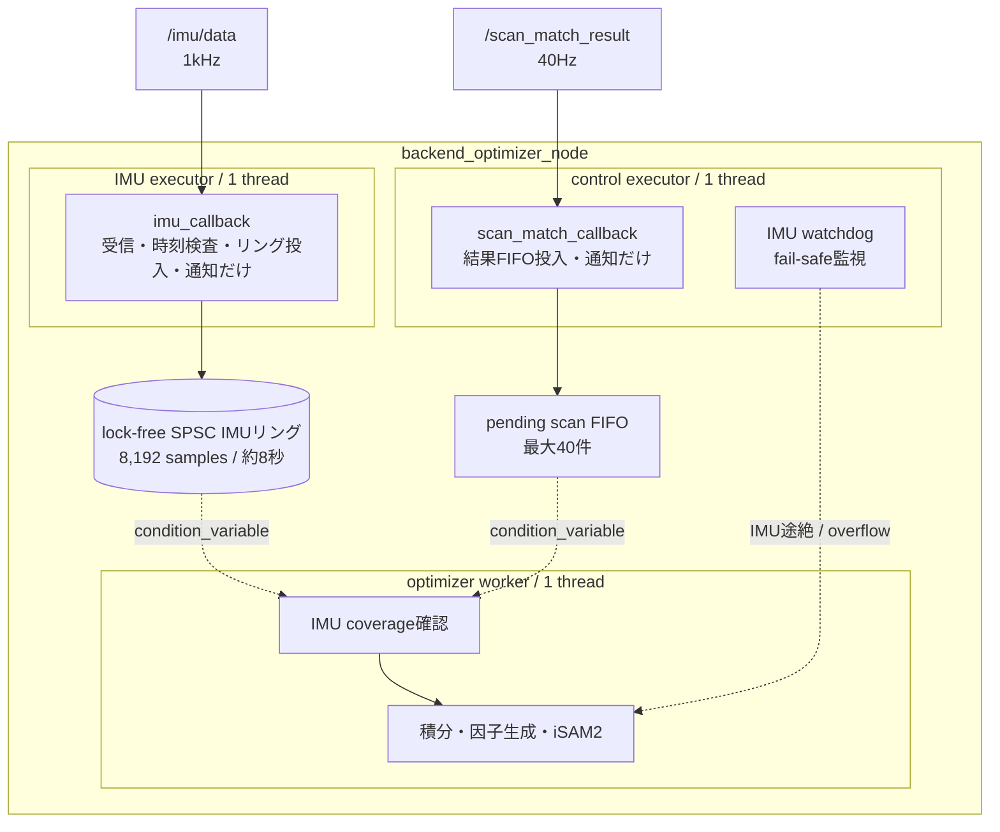

# Backend Optimizer 推定手順(2026-07-31更新)

`lio_localization::BackendOptimizerNode` の因子グラフ構造とデータフローの図。
2026-07-28の減速時誤差スパイク調査で確認した構造を元に作成し、2026-07-29の
専用最適化ワーカー、IMU専用executor、lock-free SPSC IMUリングバッファを反映。
2026-07-30に②(`laser_scan_matching_node`)側にも同型の専用ICP workerを追加した
(実行ドメイン節末尾の追記、experiment_history 14番参照)。要件Aの達成状況・
残る誤差要因の最終的な切り分け結果は
[localization_final_report_2026-07-30.md](localization_final_report_2026-07-30.md)
にまとめてある。2026-07-31に②の実共分散配信・軸別対応点数の実分類を実装し、
一度も発火しなかったDCS(壁側)・imu_dynamics_\*(IMU側)を削除した
(experiment_history 20・22番参照、後述の各節に反映済み)。

## 実行ドメイン



IMU callback groupはnodeへ自動登録せず、IMU executorへ手動で割り当てる。そのため
scan callbackやwatchdogがreadyでも、IMU callbackの実行枠を奪えない。iSAM2はROS
executorではなくoptimizer workerだけが所有する。したがって、3スレッドは同じ仕事を
競合して実行するためではなく、**IMU受信・control callback・最適化を互いにブロックしない
ための固定した責務分離**である。

## 全体フロー

2026-07-31訂正: 以前のこの図は円柱BearingRangeFactor・`check_divergence`
(発散判定)・LiDAR途絶診断リセットが抜けていた(ユーザー指摘で発覚)。
以下は毎スキャンの因子構築を示す図で、リセット/セーフティネット系の詳細は
次の「リセット・セーフティネットの全経路」の図に分離した。ZUPT
(Zero-velocity Update)は同日中に試験・不採用が確定していたため図に
追加せずコードごと削除した(下記「削除済みの実験的機構」参照)。

```mermaid
flowchart TD
    IMU["IMU /imu/data<br/>1kHz"] --> QUEUE["imu_queue_<br/>(imu_callback)"]
    SCAN["LiDARスキャン<br/>40Hz"] --> PERCEPTION["② 知覚(laser_scan_matching_node)<br/>planar 2D point-to-segment solverが<br/>実際にwall姿勢を公開(詳細は次節)"]
    PERCEPTION --> SMR["ScanMatchResult<br/>(wall + cylinders)"]

    SMR --> PEND["pending_results_<br/>(scan_match_callback)"]
    PEND --> EVENT["condition_variableへ通知<br/>(callbackはここで終了)"]
    QUEUE -.->|"IMU到着時にも通知"| EVENT
    EVENT --> DRAIN{"専用optimizer worker<br/>スキャン時刻分のIMUは<br/>全部届いた?"}
    DRAIN -->|"未着"| WAIT["condition_variableで待機<br/>(次の通知で再判定)"]
    DRAIN -->|"到着済み"| PROCESS["process_scan_result<br/>(GTSAMは専用workerだけが実行)"]

    PROCESS --> INTEGRATE["integrate_imu_up_to<br/>実測dtで積分<br/>+端数はゼロ次ホールドで詰める"]
    INTEGRATE --> ACCUMULATOR[("accumulator_<br/>backend_optimizer_nodeの<br/>メンバ変数(常駐バッファ)")]
    ACCUMULATOR --> IMUFACTOR["CombinedImuFactor<br/>(無条件で必ず追加)<br/>※wallの値は一切参照しない"]

    PROCESS -->|"wall.valid"| WALLGATE{"π反転ロック対策ゲート<br/>d_xy > wall_gate_xy_(1.0m) or<br/>d_yaw > wall_gate_yaw_(1.2rad)?"}
    WALLGATE -->|"いいえ(通常範囲)"| WALLFACTOR["壁PriorFactor<br/>(σ=ヒューリスティックと②の実共分散<br/>のクランプ、make_robustでHuber包み)"]
    WALLGATE -->|"はい(拒否)"| REJECT["consecutive_wall_rejections_++<br/>(このスキャンは壁因子を追加しない、後述の図参照)"]

    PROCESS -->|"msg.cylinders(検出分だけ)"| CYLFACTOR["円柱BearingRangeFactor<br/>(登録済みIDのみ、make_robustでHuber包み)<br/>現行yamlはcylinder_ids未設定のため常に0件"]

    IMUFACTOR --> ISAM2["IncrementalFixedLagSmoother.update()<br/>(ISAM2, lag=0.5s)<br/>全因子をまとめて最適化<br/>(例外/発散判定は次の図参照)"]
    WALLFACTOR --> ISAM2
    CYLFACTOR --> ISAM2

    ISAM2 --> ESTIMATE["/state_estimate publish<br/>(40Hz、backend自身の出力)"]
    ESTIMATE -.->|"①がこれを基準にIMUで外挿"| ODOMFAST["①imu_preintegration_node<br/>/odom_fast (~1kHz)<br/>評価・ロボット制御(閉ループ)が使うのはこちら<br/>2026-07-31: 生加速度が異常閾値超過時は<br/>ノルムのみ切り詰めて積分(衝突対策)"]
    ISAM2 -.->|"次スキャンに向けて空にする"| RESETACC["accumulator_リセット<br/>(resetIntegrationAndSetBias)"]
    RESETACC -.-> ACCUMULATOR
    style SCAN fill:#2a2410,stroke:#996
    style PERCEPTION fill:#2a2410,stroke:#996
    style SMR fill:#2a2410,stroke:#996

    style INTEGRATE fill:#1a2a1a,stroke:#393
    style ACCUMULATOR fill:#1a2a1a,stroke:#393
    style IMUFACTOR fill:#1a2a1a,stroke:#393
    style RESETACC fill:#1a2a1a,stroke:#393

    style WALLGATE fill:#1a2a3a,stroke:#369
    style WALLFACTOR fill:#1a2a3a,stroke:#369
    style REJECT fill:#1a2a3a,stroke:#369
    style CYLFACTOR fill:#1a2a3a,stroke:#369

    style ISAM2 fill:#2a1a3a,stroke:#639
    style ESTIMATE fill:#2a1a3a,stroke:#639
    style ODOMFAST fill:#2a1a3a,stroke:#639
```



## リセット・セーフティネットの全経路(2026-07-31追加)

この図は「推定が壊れた/壊れかけたとき、どう気づいてどう立て直すか」の
安全機構をまとめたもの。**壊れ方には4種類あり、検知する場所も理由もバラバラ
だが、最終的には全部「同じ立て直し処理」に合流する**、というのがこの図の
一番伝えたい構造。4種類とは:

| # | 何が起きた状況か | どこで検知するか |
|---|---|---|
| ① | ISAM2の内部計算が数値的に破綻した(縮退・特異な行列など) | `smoother_->update()`が例外を投げる |
| ② | 計算自体は成功したが、出てきた速度やバイアスが物理的にありえない大きさ | 更新成功後に`check_divergence()`で事後チェック |
| ③ | LiDARによる壁補正がしばらく(2.5秒超)全く得られていない | 毎スキャン`update_lidar_dropout_diagnostics`で滞留時間を計測 |
| ④ | IMU積分がほぼゼロの状態(実質何も進んでいない)が20回以上連続 | スキャン処理の入口で毎回チェック |

①②③④はコード上バラバラの場所にあるが、どれも「もう今の推定は信用できない」
という判定であり、**同じ`reset_graph_after_divergence()`**(信頼できていた
最後の状態=`trusted_pose_`等へグラフを作り直す)を呼ぶ。ただし連続リセットで
逆に不安定化しないよう、`kResetCooldownSec`(0.5秒)以内に既にリセット済み
なら今回は見送り、代わりに「まだ壊れている」という印(`smoother_poisoned_`)
を次のスキャンへ持ち越して再度チェックする。以下の図はこの全体を、実際に
コードが実行される順番(スキャン処理の入口→IMU積分→ISAM2更新→コミット後の
監視)に沿ってたどれるようにしたもの。

```mermaid
flowchart TD
    subgraph GUARD["スキャン処理の入口ガード(候補④はここで検知)"]
        ENTRY["process_scan_resultの入口<br/>(毎スキャン最初にここを通る)"]
        ENTRY --> POISONCHECK{"すでに壊れている印<br/>(smoother_poisoned_)が<br/>立ったままか?"}
        POISONCHECK -->|"はい:前回リセットを<br/>見送っていた"| RETRYWAIT["クールダウン明けを待つだけ<br/>(このスキャンは何もしない)"]
        POISONCHECK -->|"いいえ:正常"| INTCHECK{"直近リセット直後などで<br/>IMU積分がほぼ0のまま<br/>(deltaTij < 5ms)か?"}
        INTCHECK -->|"いいえ:通常通り積分できている"| UPDATE
        INTCHECK -->|"はい"| SKIPCOUNT["「積分できなかった回数」を+1"]
        SKIPCOUNT --> SKIPGATE{"それが20回<br/>(≈0.5秒)連続したか?<br/>=④ IMU積分が慢性的に不足"}
        SKIPGATE -->|"いいえ:まだ様子見"| RETURN1["このスキャンだけ諦めてreturn<br/>(次のIMUに期待)"]
        SKIPGATE -->|"はい:④発動"| COOLDOWN
    end

    subgraph OPT["ISAM2更新(候補①②はここで検知)"]
        UPDATE["smoother_->update()<br/>(今回の全因子をまとめて最適化)"]
        UPDATE -->|"① 数値的に破綻<br/>(縮退・特異な行列など)"| EXC["例外をcatch<br/>→壊れている印を立てる"]
        UPDATE -->|"計算自体は成功"| DIVCHECK{"出てきた速度・バイアスは<br/>物理的にありえない大きさか?<br/>(候補②)"}
        DIVCHECK -->|"はい:② 発散と判定"| DIVPOISON["壊れている印を立てる"]
        DIVCHECK -->|"いいえ:妥当"| COMMIT["この推定値を正式採用<br/>(current_index_等を更新、<br/>/state_estimateへ配信)"]
    end

    subgraph MONITOR["採用後も続く監視(候補③はここで検知)"]
        COMMIT -->|"壁補正が効いていて<br/>速度も物理上限内"| TRUST[("「信頼できる最後の瞬間」として<br/>trusted_pose_等を更新<br/>(リセット時の戻り先)")]
        COMMIT --> DROPCHECK{"壁補正が得られない状態が<br/>2.5秒を超えて続いているか?<br/>(候補③、IMUだけで無限に<br/>ドリフトし続ける状態)"}
        DROPCHECK -->|"いいえ:壁補正は生きている"| PUBLISH["通常通り配信して終わり"]
        DROPCHECK -->|"はい:③発動"| COOLDOWN
    end

    EXC --> COOLDOWN
    DIVPOISON --> COOLDOWN

    subgraph RESETCOMMON["共通の立て直し処理(①②③④はすべてここに合流)"]
        COOLDOWN{"前回リセットから<br/>0.5秒(kResetCooldownSec)<br/>経っているか?"}
        COOLDOWN -->|"はい"| RESETFN["reset_graph_after_divergence()<br/>2026-07-31変更: trusted_pose_等を<br/>ファイルへ書き出しプロセスごと終了<br/>(respawn_process参照、走行中のin-process<br/>再構築はGTSAM/TBBがクラッシュするため廃止)"]
        COOLDOWN -->|"いいえ:連鎖防止のため見送る"| FREEZE["リセットせず状態を凍結<br/>(壊れている印は立てたまま<br/>次スキャンの入口ガードで再判定)"]
    end

    REJECT2["壁ゲート拒否が連続している<br/>(consecutive_wall_rejections_、前の図参照)"] -->|"40回連続(~1秒)<br/>かつクールダウン経過"| CYLCHECK{"円柱観測を使って<br/>「壁の言い分」と「IMU予測」の<br/>どちらが正しいか判定できるか?"}
    CYLCHECK -.->|"現行yamlは円柱を<br/>1本も登録していないため<br/>判定材料(観測数0)が無く<br/>常に発火しない"| RELOC["(本来の設計、respawn_process経由)<br/>壁側支持なら再定位<br/>そうでなければ拒否を継続"]

    PARTICLE["②のパーティクル再収束が収束<br/>(relocalization_event=true、次節参照)"] -->|"π反転ロック対策ゲートを<br/>無条件でバイパス"| RESPAWNPROC["request_process_respawn()<br/>姿勢/速度/バイアス/事前分布σを<br/>ファイルへ書き出しプロセス終了(exit 42)<br/>→launch/respawnラッパーが即座に<br/>白紙のプロセスとして再起動、約0.5秒"]
    RESETFN -.->|"同じ関数を使う"| RESPAWNPROC
    RELOC -.->|"同じ関数を使う"| RESPAWNPROC

    style UPDATE fill:#2a1a3a,stroke:#639
    style DIVCHECK fill:#2a1a3a,stroke:#639
    style COMMIT fill:#2a1a3a,stroke:#639
    style DROPCHECK fill:#2a1a3a,stroke:#639
    style PUBLISH fill:#2a1a3a,stroke:#639
    style TRUST fill:#1a2a1a,stroke:#393

    style EXC fill:#3a1a1a,stroke:#a33
    style DIVPOISON fill:#3a1a1a,stroke:#a33
    style RESETFN fill:#3a1a1a,stroke:#a33
    style COOLDOWN fill:#3a1a1a,stroke:#a33
    style FREEZE fill:#3a1a1a,stroke:#a33

    style REJECT2 fill:#1a2a3a,stroke:#369
    style CYLCHECK fill:#555,stroke:#888,stroke-dasharray: 5 5
    style RELOC fill:#555,stroke:#888,stroke-dasharray: 5 5

    style PARTICLE fill:#1a2a3a,stroke:#369
    style RESPAWNPROC fill:#3a1a1a,stroke:#a33

    style ENTRY fill:#2a2410,stroke:#996
    style POISONCHECK fill:#3a1a1a,stroke:#a33
    style RETRYWAIT fill:#3a1a1a,stroke:#a33
    style INTCHECK fill:#1a2a1a,stroke:#393
    style SKIPCOUNT fill:#1a2a1a,stroke:#393
    style SKIPGATE fill:#3a1a1a,stroke:#a33
    style RETURN1 fill:#1a2a1a,stroke:#393
```



**4つの独立したトリガー**(①ISAM2例外catch節、②`check_divergence`成功後判定、
③LiDAR途絶診断、④`consecutive_integration_skips_`超過)がいずれも
`kResetCooldownSec`(0.5秒)でスロットルされる同じ`reset_graph_after_divergence()`
へ合流する。さらに、いずれかがクールダウン未経過で見送られた場合は
`smoother_poisoned_`が立ったまま次スキャンへ持ち越され、`process_scan_result`の
入口で毎回クールダウン判定だけがリトライされる(poisoned中は他の処理を
一切行わない)。リセット先は直前の推定値(`last_pose_`等、発散検知が発火する
頃には既にずれている可能性がある)ではなく、「壁補正が効いていて速度が
物理上限内だった最後の瞬間」として別途保持している`trusted_pose_`/
`trusted_velocity_`/`trusted_bias_`。壁ゲート拒否の連続
(`consecutive_wall_rejections_`)からの円柱ベース再ローカライズは、現行Unity
設定で円柱が一切登録されていないため判定材料(観測数0)が無く、実質
デッドコードのまま。

**2026-07-31: 走行中の「グラフをその場で作り直す」経路は全廃し、
プロセス再起動方式に統一した**(`request_process_respawn()`、
experiment_history 23番)。上記①②③④の`reset_graph_after_divergence()`と、
円柱ベース・パーティクルベースの2つの再定位(次節参照)は、いずれも
「蓄積済みの過去ノード群と非連結な新アンカーを、走行中のsmootherへ
1回のincremental update()で挿入する」という同じ形をしていた。この形は
GTSAMが依存するIntel TBBの内部コンテナ(周辺化処理で使われる
`concurrent_vector`系)で`std::out_of_range`("Index out of requested size
range")を毎回即座に発生させ、発散検知が誤発火→巻き戻し→再発散を無限に
繰り返す壊滅的リグレッションを引き起こすことが判明した(パーティクル
再収束の実地検証で発覚。smoother_オブジェクト自体を作り直しても
使い回しても再現するため、原因はオブジェクト差し替えではなくGTSAM/TBB
内部の周辺化処理そのものにある)。プロセス起動直後(過去ノード履歴が
ゼロ)の`initialize_graph()`だけは一度も再現しないため、3経路とも
「姿勢/速度/バイアス/事前分布σをファイルへ書き出してプロセスごと
`rclcpp::shutdown()`し、`ros2 launch`の`respawn=True`(テストスクリプトは
専用の終了コード42検知ラッパー)で完全に白紙のプロセスとして再起動する」
方式へ統一した。実測で復帰まで約0.5秒。

### 図の各ブロックの補足説明

**両方のコールバックは受信・キュー追加・ワーカー通知だけを行う**

`imu_callback`(IMU到着時)・`scan_match_callback`(スキャン結果到着時)は、それぞれ
自分のFIFO(`imu_queue_`, `pending_results_`)へ追加し、condition variableで専用
optimizer workerを起こして終了する。workerは先頭スキャンの時刻までIMUが届いたことを
確認してから`process_scan_result`・IMU積分・ISAM2更新を直列実行する。GTSAMの状態を
触るのはこのworkerだけである。IMU callback groupは専用`SingleThreadedExecutor`、
scan callbackとwatchdogは別の`SingleThreadedExecutor`で動くため、ISAM2更新中だけでなく
control executor内のcallback実行中にもIMU executorは1kHz受信を継続できる。

`imu_queue_`は動的に伸びる`deque`ではなく8,192件の固定長**lock-free SPSCリング**である。
専用IMU executorだけがproducer、optimizer workerだけがconsumerなので、1kHzの投入・取り出し・
積分に`work_mutex_`は使わない。通常は2秒ホライズンで古い値を削除する。この削除もproducerでは
なくwatchdogから通知されたworkerが、保留スキャンも実行中ジョブも無いときだけ行う。従ってworkerが
必要とする積分区間を並行して消すことはない。8秒相当まで滞留した場合は、IMUを黙って捨てて不連続な
因子を作る代わりにoverflowをfail-safeとしてラッチする。`pending_results_`は40Hz・最大40件の
低頻度FIFOで、こちらと`worker_stop_`・`optimizer_busy_`だけを`work_mutex_`で保護する。
重いISAM2更新中にはmutexを保持しない。IMUサブスクリプションの深いQoS(`SensorDataQoS().keep_last(2000)`)も輸送・
スケジューリングの短時間ジッタに対する余裕として維持する。

ノード破棄時は停止フラグを設定してworkerを起こし、`join()`完了後にメンバを破棄する。
また、IMU watchdogが並行してfail-safeをラッチした場合は保留スキャンを破棄し、
取り出し済みジョブからの`/state_estimate`公開も抑止する。

**②(`laser_scan_matching_node`)にも同型の専用ICP workerがある(2026-07-30追加)**

backendと同じ「executorはキュー投入だけ、重い処理は専用workerだけが触る」パターンを
②にも適用した(experiment_history 14番)。以前は`odom_callback`(/odom_fastの
姿勢履歴追記)・`imu_callback`(生ジャイロ履歴追記)・`scan_callback`(ICP本体)が
すべて同一の単一executorスレッド上で直接実行されており、ICP1回(数ms〜数十ms)の間
①からの受信そのものが止まって姿勢履歴が古びる問題があった(Unity直結時のみbag再生
より最大誤差が悪化する原因、experiment_history 13番)。現在は`odom_callback`/
`imu_callback`を専用`pose_callback_group_`(backendのIMU executorと同じ設計)に
分離し、ICP本体(`process_scan`)は`icp_worker_`専用スレッドが、`odom_history_`/
`gyro_history_`のスナップショットを取ってから実行する。`scan_callback`は
`pending_scans_`へのFIFO投入と通知だけを行う。

**IMU積分(`integrate_imu_up_to`)は「時間を揃えるための作業」**

`imu_queue_`に貯まっている1kHzのIMUサンプルを、古い順に1個ずつ取り出して`accumulator_`(GTSAMの積分器)に足し込んでいく。ポイントは2つ:

1. 各サンプルは「前のサンプルとの実際の時刻差(dt)」で積分する(1msと決め打ちしない)。ホスト負荷でdtが伸び縮みしても正しく積分できるようにするため
2. 最後、積分した最新サンプルの時刻と「今回のスキャンの時刻」の間にわずかな端数(1ms未満〜数十ms)が残ることがあるので、直近のIMU値を保持したままその端数分も埋める(ゼロ次ホールド)。これにより積分の終わり目を必ずスキャン時刻ぴったりに揃える

**IMU因子は独立。壁補正が拒否されても「IMU因子だけ」ではない**

`CombinedImuFactor`は`accumulator_`(=IMU積分結果)だけから作られ、`wall`の値を一切見ない。物理妥当性ゲートで壁補正が拒否された回は、**新しい壁PriorFactorがグラフに追加されないだけ**。その回の状態(推定値)は、今回のIMU因子に加えて、fixed-lag窓(0.5秒)内にまだ残っている過去の壁因子・過去の状態・(登録されていれば)円柱因子との**同時最適化**で決まる。直前までの壁補正による拘束の影響は窓内で生き続ける。

**壁補正のゲートは拒否/採用の二択(2026-07-31: DCSは削除済み)**

以前は物理妥当性ゲート(`d_xy`, `d_yaw`)を3段階(通常採用/DCSで重み低下/拒否)
にしていたが、**DCS段階は全検証を通じて一度も発火しなかった**(通常運用の
`d_xy`は常にmm規模で、DCSが効くはずの中間領域に一度も入らなかった)ため
2026-07-31に削除した(experiment_history 22番)。現在はπ反転ロック対策の
単純な二択のみ:

1. `d_xy <= wall_gate_xy_`(1.0m)かつ`d_yaw <= wall_gate_yaw_`(1.2rad): 採用
2. どちらか超過: 拒否、`consecutive_wall_rejections_`をインクリメント

壁PriorFactorのσ自体は、この節とは別の仕組み(N数ヒューリスティック下限+②の
実共分散上限のクランプ)で毎スキャン動的に決まる。詳細は下記「知覚(②
laser_scan_matching_node)の詳細」節を参照。

**円柱BearingRangeFactorは条件付きで壁PriorFactorと並列に追加される**

円柱BearingRangeFactorは`ScanMatchResult.cylinders`に含まれ、かつ
`registered_cylinders_`に登録済みのIDだけ追加される(現行yamlは
`cylinder_ids`が空のため常に0件)。壁PriorFactorと同様に`make_robust()`で
Huberロバスト核に包まれてからグラフへ追加される。ZUPT(Zero-velocity
Update)も同様に条件付きで速度=0のPriorFactorを追加する仕組みだったが、
既定無効のまま試験した2パターン(閾値0.1/0.5m/s)がいずれも効果薄・悪化
だったため2026-07-31に削除した(下記「削除済みの実験的機構」参照)。

最後に、ISAM2の更新が終わると`accumulator_`は次のスキャン区間に向けてリセットされ(積分結果はこの1回だけで使い切り)、また次のスキャンが来るまで新しいIMUを貯め始める。`accumulator_`自体は`BackendOptimizerNode`クラスのメンバ変数(`backend_optimizer_node.hpp`)で、別ノードや外部コンポーネントではなく、backendプロセス内に1つだけ常駐しているバッファ。

**`/state_estimate`(40Hz)と`/odom_fast`(~1kHz)は別物**

backend自身が出す推定値は`/state_estimate`で、スキャン処理と同じ40Hz。時間分解能が粗く見えるかもしれないが、これは①(imu_preintegration_node)が`/state_estimate`を基準としてIMU積分だけで~1kHzへ外挿し続けた`/odom_fast`を別途配信しており、評価やロボットの制御ループが実際に使っているのはこちら。つまり「40Hzの絶対補正 + 1kHzのIMU外挿」の組み合わせで、実効的な時間分解能はIMU側(1kHz)まで確保されている。

**IMU fail-safeはロボットを止めない**

`imu_watchdog`が途絶を検知して行うのは、backendの以降のグラフ更新停止(`imu_fault_latched_=true`)だけ。モータ停止指令や安全制御へのエラー通知は出さない。「自己位置推定の出力を止める」ことは保証するが、「ロボットを安全に停止させる」ことはこのシステム単体では保証されず、`/odom_fast`(または`/state_estimate`)の途絶を検知して停止する契約を制御側に別途持たせる必要がある。

## パーティクルフィルタもどきによる全域再収束(2026-07-31追加)

上記の①②③④(発散検知)は「いま追跡している姿勢の近傍で立て直す」ための
機構で、円柱ベース再定位は非対称なランドマークで区別する設計だったが
現行フィールドに円柱が存在せず機能しない(`RoboconFieldBuilder.cs`は
`CreateBox`しか呼んでおらず、円柱状の物体は一切無い)。10x8mの長方形
フィールドは壁だけでは実質180°回転対称に近く(厳密な対称ではないが、
壁のみのスキャンマッチングでは十分に見分けがつかないことを実験的に
確認済み)、②の収束半径は並進約12cm・回転数度程度しかないため、これより
大きくロストした場合(衝突による大きな乱れ・強制リトライでの再配置など)
に頼れる復帰手段が無かった。

これに対し、②(`laser_scan_matching_node`)に古典的なMonte Carlo
Localization(パーティクルフィルタ)による全域再収束を実装した
(`step_particle_relocalization()`)。②で平面ソルバーの無効判定
(`consecutive_planar_invalid_`)が閾値を超えて連続すると起動する:

1. フィールド全体に姿勢候補(パーティクル)を既定1000個、一様ランダムに散布
2. 毎スキャン、①からのオドメトリ差分(デルタ)で各パーティクルを運動モデル
   伝播(ノイズ付き)
3. 各パーティクルの姿勢で今回の点群を壁地図へ投影し、最近傍壁までの距離の
   二乗和から尤度を計算して重み付け
4. systematic resamplingで重みに応じて再サンプリング
5. パーティクル集団の標準偏差(並進・回転とも既定0.05)が閾値を下回ったら
   収束と判定し、加重平均姿勢を採用

収束した回だけ`ScanMatchResult.wall.relocalization_event`をtrueにして
backendへ通知する。backendは②のROS_ERRORログでも収束を明示する
(「PARTICLE RELOCALIZATION ACTIVATED/CONVERGED」)。これは収束が「うまく
動く回復手段」であることを歓迎する意味ではなく、**そもそもこの経路が
発動すること自体が上流のバグの兆候**であるため、毎回ログで警告し
root-cause調査を促す設計。backend側の受理は前節の`request_process_respawn()`
(プロセス再起動方式)を経由する。

検証(`mcp_collision_check_20260731/live_capture`bag、意図的に大きく
誤らせた初期位置(1.0, -1.0, 1.57rad)で②③を起動): パーティクルが収束した
姿勢は(-2.42, 1.35, 0.00)、真の開始位置(-2.419, 1.354, 0.000)とほぼ完全に
一致。backend受理からプロセス再起動・復帰までは実測約0.48秒。以後は
例外・再発散ゼロで安定動作を確認した(旧: in-process再構築方式では同じ
シナリオで1秒あたり2回ペースのクラッシュループに陥り、位置誤差が
数百〜数千mmで高止まりし続けていた)。

なお、円柱ベース再定位の判定にも使われている
`consecutive_planar_invalid_`/`kYawLostModeThreshold`が起動条件で、これは
以前この位置にあった「±πヨーロスト検知(yaw-lost-mode)」を置き換えた
ものである。旧`enable_lost_mode_`(汎用3D ICP経路専用で、実際には未使用の
`result.wall`を書き換えるだけだったため再収束に無力と判明)と、平面
ソルバーの`solve_planar_coarse_to_fine`(粗探索、最大4倍のゲート拡大
≈0.48mしかなく本格的なkidnap規模の再捕捉には無力と判明)は、いずれも
削除済み。

## 状態変数

| 記号 | 型 | 内容 | 生存期間 |
|---|---|---|---|
| `X(k)` | Pose3 | 位置+姿勢 | スキャン毎、lag超過で周辺化 |
| `V(k)` | Vector3 | 速度 | 同上 |
| `B(k)` | ConstantBias | 加速度計+ジャイロバイアス(6次元) | 同上 |
| `C(id)` | Point3 | 円柱ランドマーク位置 | 検出され観測が続く限り保持。グラフリセット時(`reset_graph_after_divergence`)は`cylinders_in_graph_`がクリアされ消える |

円柱は`X(k)`に対する絶対拘束ではなく、事前分布σ=既定0.5m(かなり緩い)を持つ独立した状態変数として最適化対象に含まれる。「既知の地図情報」として扱うなら、位置を固定値にするか、実測地図精度相当(数mm〜数cm)まで事前分布を締める方が論理的に一貫する(現状Unity設定では円柱自体が未登録のため精度への影響はない)。

## 知覚(② laser_scan_matching_node)の詳細

実際にwall姿勢として`ScanMatchResult`に公開されるのは**planar 2D point-to-segment
solver**であり、汎用3D ICP(coarse-to-fine、対応距離を広→狭へ段階的に絞る方式)は
**未マップ点・円柱抽出のためだけに実行され、その壁姿勢はUnityフィールドでは一切
公開されない**。コード上も明記されている:

```cpp
// The generic 3-D ICP remains available for its unmatched-point/circle extraction
// below, but it must never publish a pose correction in this Unity field path.
```
(`laser_scan_matching_node.cpp:851`付近)

planar solverの処理順序(`laser_scan_matching_node.cpp:772`付近):

1. **planar ICP 第1パス**: 全点を使って2D位置(x, y, yaw)を解く(Gauss-Newton的な反復)。この時点ではnotesの影響でまだ数mm〜cm程度バイアスされ得るが、次のnotes判定には十分
2. **未マップ点の抽出**: 第1パスの姿勢から、既知の壁セグメントに近い点を除いた「地図で説明できない点」を集める
3. **notes候補のクラスタ除外**: 隣接する未マップ点をクラスタ化し、クラスタの大きさ(`ball_exclusion_max_extent_`)と点数(`ball_cluster_min_points_`)がnotes(Blue/Orangeどちらも対象)らしい範囲に収まるものだけを除外対象にする
4. **planar ICP 第2パス**: 除外後の点群で再度solve(除外点が無ければ第1パスの結果をそのまま使う)

有効性判定(`planar_valid`)は次の**4条件**(対応点の割合は使わない):

- 対応点数が`planar_min_inliers_`以上
- 平均残差が`planar_max_mean_residual_`以下
- 初期シードからの**位置補正量**(`planar_shift`)が`planar_max_shift_`(現行yaml: 0.12m)以下
- 初期シードからの**ヨー補正量**(`planar_yaw_shift`)が`planar_max_yaw_shift_`(現行yaml: 0.08rad)以下

**全体の対応点数N・軸別内訳・共分散値、すべて実測(2026-07-31修正済み)**

以前は軸別内訳がNの機械的な折半、共分散が固定値という状態だったが、2026-07-31
に両方とも実装し直した(experiment_history 20・22番)。

```cpp
result.wall.correspondence_count = planar_inliers;             // 実測(スキャンごとに変動)
result.wall.x_axis_correspondence_count = planar_count_x_facing; // 実測: 各対応点の法線を見て
result.wall.y_axis_correspondence_count = planar_count_y_facing; // X向き/Y向きへ実際に分類
result.wall.x_axis_degenerate = (planar_count_x_facing < min_axis_inliers);  // 実測に基づく判定
result.wall.y_axis_degenerate = (planar_count_y_facing < min_axis_inliers);
result.wall.covariance = /* Cov = wall_cov_range_sigma_^2 * planar_h^-1 */;  // Censi 2007型、実測Hessianから計算
result.wall.covariance_valid = /* Hessianの正定値性チェックを通過したか */;
```
(`laser_scan_matching_node.cpp`、`solve_planar`/`solve_planar_ray_to_wall`内の
`planar_count_x_facing`/`planar_count_y_facing`集計と、最終反復のGauss-Newton
情報行列`planar_h`から共分散を計算する箇所を参照)

`correspondence_count`(全体N)は**planar ICPの実際の対応点数**で、スキャンごとに
本当に変動する(実測: 484〜541)。backendの`yaw_sigma = wall_prior_base_yaw_sigma_
/ √N`はこの実測Nに基づいて正しく動的計算されている。

軸別内訳(`x_axis_correspondence_count`/`y_axis_correspondence_count`)は、
各対応点の壁法線が`|normal.x| > |normal.y|`ならX向き、そうでなければY向きへ
実際に分類した実測値。縮退フラグ(`x_axis_degenerate`/`y_axis_degenerate`)も
この実測カウントに基づき、片方向の壁面しか見えていない場面(角・スラローム
バッフル遮蔽等)で正しく発火するようになった。

共分散(`wall.covariance`)は、平面ソルバーの最終反復のGauss-Newton情報行列
(x,y,yaw順、Huber重み込み)から`Cov = wall_cov_range_sigma_^2 * H^-1`
(Censi 2007型)で計算し、backendが期待する(yaw,x,y)対角順に並べ替えて配信する。
固有値が縮退している(ほぼ特異)場合は`covariance_valid=false`とし、backend側は
従来のN数ヒューリスティックへフォールバックする。backend側のクランプ
(`wall_use_icp_covariance_`)は、この実共分散を「N数ヒューリスティックσを
下限、縮退σを上限として緩める方向にのみ」反映する構造は変わっていない。

**円柱(ビンゴポスト)マッチングと復旧経路は現行Unity設定では機能しない**

現行の`robocon2026_unity.yaml`には`cylinder_ids`/`cylinder_x`/`cylinder_y`が一切
設定されておらず、`registered_cylinders_`が空になる。そのため:

- 円柱`BearingRangeFactor`は発生しない(観測数は常に0)
- 壁補正拒否が連続した際の「円柱で真偽判定→再ローカライズ」という復旧経路(main.md記載の設計)は、円柱観測が無いため判定不能で機能しない — 拒否が続く限り拒否し続けるだけになる
- さらに`dropout_error_sec=120秒`に対して評価窓は60秒のため、**LiDAR信頼性喪失によるERRORレベルの通知(main.md記載)もベンチマーク中には発火しない**

現行のUnity試験構成には、持続的な壁/IMU不一致からの自動復旧経路が事実上存在しない。

### ScanMatchResult(知覚→backendのメッセージ)

```
std_msgs/Header header
WallCorrection wall              # 実際に公開されるのはplanar 2D solverの結果(全体N・軸別内訳・共分散すべて実測、2026-07-31修正済み)
CylinderObservation[] cylinders  # 検出された円柱の観測(現行Unity設定では常に空配列)
```

## 生IMU値の直接調査(2026-07-28)

`raw_imu_inspect_20260728`はガウス性の白色雑音のみを停止した実験で、固定バイアス
(x=+0.05, y=-0.03)・ジャイロバイアス(z=+0.005)・ランダムウォーク(σ=0.0001)は
通常運用の値のまま動作していた。`diag_raw_imu.csv`のt≧3s平均(ax=+0.0575,
ay=-0.0418, gz=+0.00426)は設定バイアス値とほぼ一致する。

`/imu/data`の生値を1kHzで記録して誤差ピーク(t≈58.95s)前後を確認した。

- az(重力方向)は9.79〜9.82 m/s²で終始一定。gz(角速度)は0.003〜0.007 rad/sで、
  設定したジャイロバイアス(+0.005 rad/s)付近で安定しており、異常な回転はない。
  信号飽和・NaN・通信破損は確認されない
- ax/ayは減速→符号反転→逆方向加速という物理的に正常な方向転換パターン
- t=58.85〜59.10s窓内の局所最大はax≈+6.20 m/s²で、設計上限(0.5G=4.905 m/s²)比では
  この1窓に限れば約26%超過。**全走行を通せば平面加速度(ax・ayの合成)の最大は
  約10.38 m/s²に達し、これは設計上限の約2.1倍(約112%超過)**であり、折り返しの
  たびに大きく超過している。t=58.95s付近1箇所だけでなく、全折り返しでの超過状況を
  対象に含めて調査する必要がある
  - PD制御力自体は`Vector3.ClampMagnitude(force, maxForce)`で確実にクランプされている
  - しかし実測加速度(速度の有限差分)は、地面摩擦・物理ソルバーの拘束解決など**制御力以外の副次的な力を含む正味の値**であり、クランプの対象外
  - backend側の`kMaxAcceleration=4.905`という壁補正ゲート計算での仮定とも齟齬があるが、この項は`dt²`(スキャン間隔≈25ms)でスケールするため通常運用ではLiDARノイズマージン(45mm)に埋もれてほぼ効かず、DCS発火・壁補正拒否のログはこのrun全体で1件も出ていない

NaN・信号飽和・通信破損といった**センサー故障の兆候はない**。ただし**設計上の運動
モデル(0.5G上限)を大きく外れた運動が実際に起きている**のは事実であり、この2つは
別の主張として扱う必要がある。「センサー値自体には異常がない」ことと「設計上限を
2倍以上超える運動をしている」ことは両立し、後者を軽視してよい根拠にはならない。

## 削除済みの実験的機構(2026-07-28の減速時スパイク調査で導入、その後棄却・削除)

- **(2026-07-31削除)** `zupt_enabled_`: 低速時にV(k)へ速度=0の疑似観測を
  追加(main.md参照、ZUPT-aided GNSS/INS factor graph文献に倣う設計)。
  既定無効のまま試した閾値0.1m/sは効果薄、0.5m/sは「まだ動いているのに
  速度=0を強制」して27.92mmスパイクを誘発し、どちらも不採用のまま一度も
  有効化されていなかったため、コードごと削除した(experiment_history 22番)。
- **(2026-07-31削除)** `imu_dynamics_enabled_`/`imu_dynamics_gyro_enabled_`:
  IMU予測速度変化(推定加速度)またはジャイロレートがしきい値超過時に壁σを
  締める機構。両方とも既定無効のまま一度も本番相当条件で有効化されず、
  Opusレビューで「壁を締める方向はIMUを相対的に硬いままにするため悪化
  しうる」と指摘されたため、コードごと削除した(experiment_history 22番)。

## この調査で切り分け済みの事項(2026-07-28)

減速直前~直後の位置誤差スパイク(12〜16mm、要件A max≤10mmをFAIL)について、以下は**今回試した設定・条件下ではいずれも改善せず、主要因である可能性が下がった**(完全に原因を棄却する試験ではない):

- バイアス(固定値・ランダムウォークいずれも、ゼロにしても同じ規模で発生)
- センサノイズ(1/10に下げてもmaxは改善せず、ヨーのみ改善)
- `smoother_lag_sec`(0.5→1.5に戻しても悪化するのみ)
- `relinearizeThreshold`(0.01→0.001でも変化なし)
- 生IMU値自体(ノイズ停止して直接確認、物理的に正常な減速→方向転換の挙動)

残る候補(2026-07-28時点の記録。以下は2026-07-30時点でのその後の切り分け結果):

- **planar solverの軸別対応点数の均等割り当て・固定共分散値**: 未修正のまま残っている(下記参照)。
- 壁補正(ICP)側の幾何学的性質: **特定済み**。ノーツ(ボール)除外ロジックの不完全性が原因(下記参照)。
- Unity物理エンジンが設計加速度上限(0.5G)を超過している事実そのもの: 事実として残るが、以下の2026-07-30調査で主要因ではないと判明。
- IMU/LiDARの時刻同期・deskewの残差、closed-loop制御自体の影響、backendの因子重み付け設計: **大部分を検証済み**(下記参照)。

## 2026-07-30の追加調査(experiment_history 13〜15番)で判明した事項

14番のICP worker分離(前節参照)により、Unity直結時の最大位置誤差はbaseline
17.55mmから4〜5mm台まで改善した。この残留する数mm級スパイクをさらに切り分けた
結果:

1. **配送・スケジューリング遅延は原因ではない**: 同じ物理走行のUnity生成センサ値を
   CSV記録→MCAP化してROS単体で再生したところ(転送ジッタ・IMUカバレッジ待ち
   タイムアウト・スムーサー遅延を実質ゼロにできる)、それでも同じ時刻・同じ大きさの
   スパイクがそのまま再現された。IMUの精度・遅延はいずれも無関係と確認済み。
2. **ノーツ除外の不完全性が主要因**: bag再生ログでノーツ由来の未説明点群とスパイク
   時刻が一致することを確認し、`RoboconFieldBuilder`のノーツ無効化フラグで
   A/Bテストした結果、最大位置誤差が4〜5mm台から1.75mmまで低下しスパイクが
   消滅した。これにより上記「軸別対応点数の均等割り当て・固定共分散値」よりも、
   ノーツ除外(`ball_exclusion_*`パラメータ)側が支配的要因であると判明した。
3. **訂正: 「残る1.7mm級の残差は旋回ダイナミクス起因」は誤りだった**。当初、
   Unity記録の`ground_truth.csv`で「実角速度0→約1.5rad/s」とスパイク時刻が
   一致すると報告したが、これは`awk`の列指定が1列ずれ、`linear_y`(横方向並進
   速度、m/s)を`angular_z`(ヨー角速度、rad/s)と誤読した解析ミスだった。
   正しい`angular_z`列は試験全体を通じて厳密に`0.0000`、姿勢クォータニオンも
   不変であり、`StartToBingoValidation.cs`の`body.constraints = FreezeRotation`
   (全軸回転を物理的に凍結、`AddTorque`等の回転制御コードも皆無)と整合する。
   **このシミュレーションではロボットは一度も物理的に回転していない**。
   実体はロボット座標系の横方向(オムニホイールによる並進)速度の急変であり、
   角速度トリガー版`imu_dynamics_gyro_*`で改善が出なかったのも、実際の
   `angular_z`が常に約0で閾値超過イベント自体がほぼ発生しないためだったと
   考えられる。「自己位置推定が実際の旋回中にどう振る舞うか」は
   [localization_final_report_2026-07-30.md §4.4](localization_final_report_2026-07-30.md)
   で改めて検証した。

要件A(定常RMSE≤10mm・最大位置誤差≤10mm)はノーツありの状態でも十分な余裕で
PASSしているため、上記1.7mm級の残差はこれ以上追う必要のある水準ではないと
判断している。詳細run一覧・数値は
[localization_final_report_2026-07-30.md](localization_final_report_2026-07-30.md)
と experiment_history 13〜15番を参照。

## 2026-07-31の追加変更(experiment_history 16〜22番)

初めて実旋回を有効化した結果(16番)を起点に、②の実共分散配信・IMU/壁の
剛性バランス調整・衝突ロバスト性まで、本ドキュメントの前提を変える変更が
複数入った。要点のみここに記す(詳細は各experiment_history番号を参照)。

1. **実旋回で初めて発覚した3つのバグを修正**(16番): Unity側の
   twist座標系・`MoveRotation`とangularVelocityの不整合・ジャイロの
   擬ベクトル符号反転。旋回を一度も物理的に試していなかったため
   これまで発現していなかった。
2. **②の実共分散配信・軸別対応点数の実分類**(20・22番): 上記「知覚(②
   laser_scan_matching_node)の詳細」節に反映済み。以前の固定`1e-5`共分散・
   機械的なN折半・常時false縮退フラグを、実際のGauss-Newton情報行列・
   実際の壁法線分類に置き換えた。
3. **IMU/壁の剛性バランス**: `CombinedImuFactor`(相対拘束)がデータシート
   ノイズ値のままだと壁prior(絶対拘束)に対して桁違いに硬く、旋回直後の
   過渡誤差(最大約28mm)の主因と判明(17番)。IMUノイズを30倍程度緩める
   ことで最良構成では最大約12mmまで改善(18番)。③(因子グラフ融合)自体は
   この構成で真値に対し最大2.5mm程度まで改善しており、③はほぼ問題ない
   ことを3段分解で確認済み(21番)。評価対象(`/odom_fast`)に残る差は
   ①(IMU外挿)側の問題である。
4. **一度も発火しなかった機構の削除・修正**(22番): `wall_dcs_scale`
   (DCS風スケーリング、上記「壁補正のゲート」節参照)・`imu_dynamics_*`
   (高ダイナミクス検知)を削除。未使用3D ICPのCensi共分散コードも削除。
   x/y軸別対応点数・縮退フラグは削除ではなく本来の設計通りに実装し直した
   (上記2と同じ)。
5. **衝突ロバスト性**(22番): 本番の強制リトライ等でロボットが物理的に
   持ち上げられ再配置される(kidnapped robot)可能性を見据え、Unity側の
   衝突検知を`/robot_collision`としてROS配信するようにした。①側で生の
   加速度が閾値(既定20 m/s^2)を超えたら、方向を保ったままノルムだけ
   切り詰めてから積分する(`imu_accel_anomaly_enabled`、既定false)。
   積分自体を止める方式は`/odom_fast`が閉ループ制御のフィードバックでも
   あるため悪化することを確認済み(閉ループ設計の詳細は本ドキュメント
   冒頭の「全体フロー」参照)。
6. **パーティクルフィルタもどきによる全域再収束の実装、およびGTSAM/TBB
   クラッシュの発見と回避**(23番): 円柱が存在しない現行フィールドでは
   kidnapped robot問題に対応する手段が無かったため、MCL方式の全域再収束を
   ②に実装(上記「パーティクルフィルタもどきによる全域再収束」節参照)。
   実装当初はbackend側で走行中に`initialize_graph()`を直接呼んで
   グラフを作り直していたが、GTSAM依存のIntel TBB内部で
   `std::out_of_range`が毎回即発生し無限クラッシュループに陥ることが
   発覚。原因はGTSAM/TBB内部の周辺化処理そのものにあり、プロセス内では
   安全に回避できないと判明したため、走行中の「その場でグラフを作り直す」
   全3経路(発散リセット・円柱再定位・パーティクル再定位)を
   `request_process_respawn()`によるプロセス再起動方式(ファイルハンドオフ
   +`respawn=True`、約0.5秒で復帰)に統一した。

これらはいずれもUnity側C#スクリプト・`laser_scan_matching_node.cpp`・
`backend_optimizer_node.cpp`/`.hpp`・`imu_preintegration_node.cpp`/`.hpp`・
`*.launch.py`・`bag_component_isolation.sh`への変更を伴う(すべて本
ドキュメント執筆時点で未コミット)。
